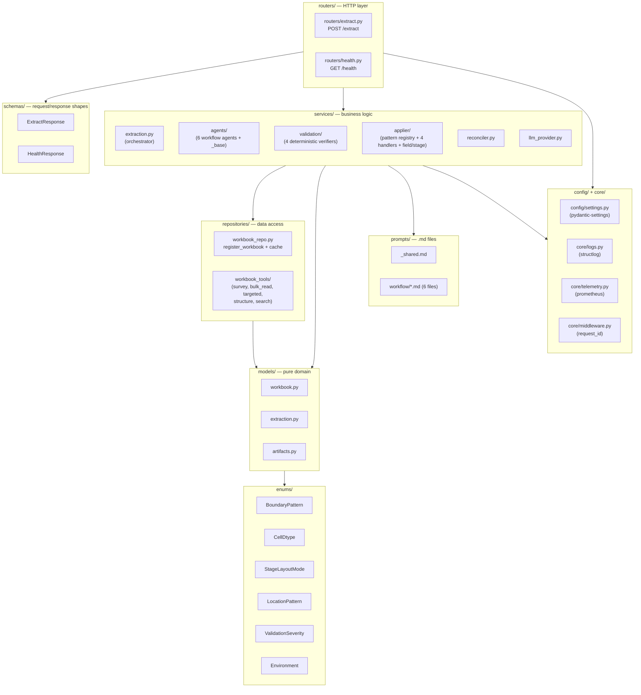
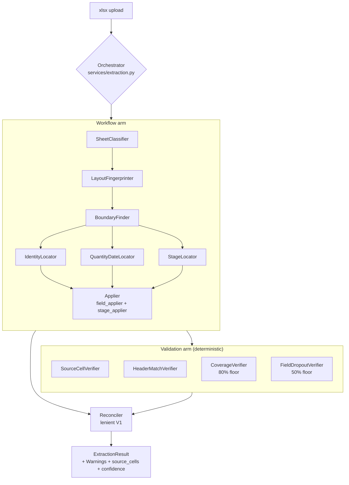
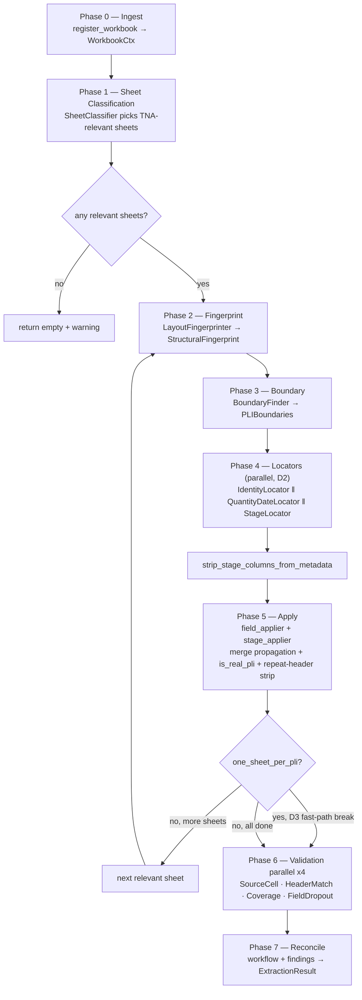
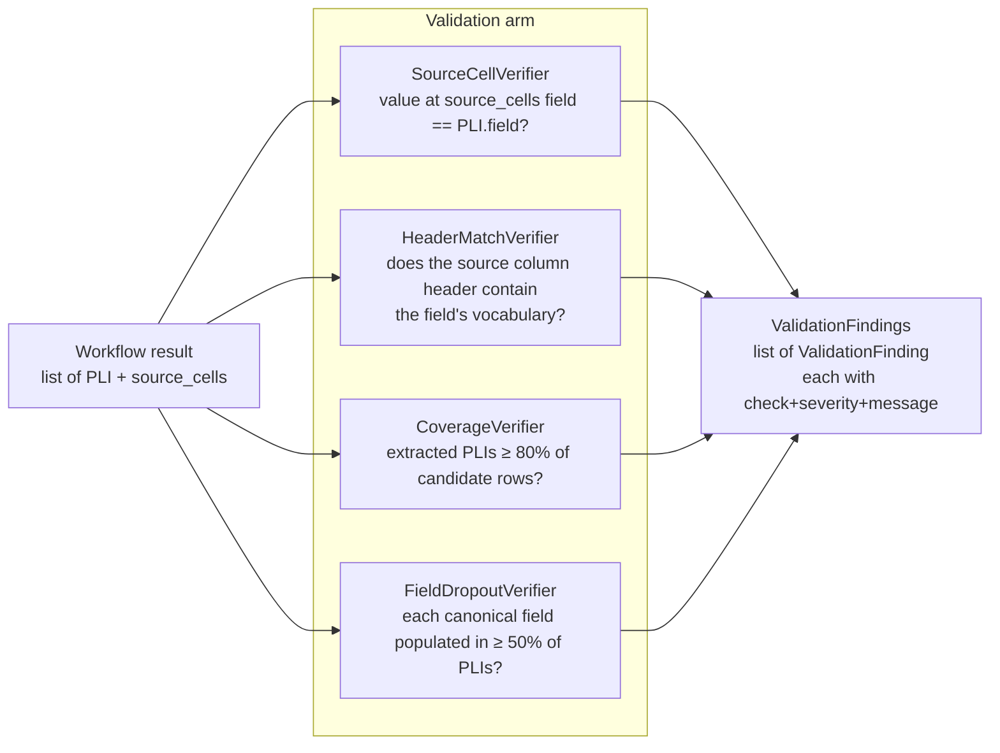
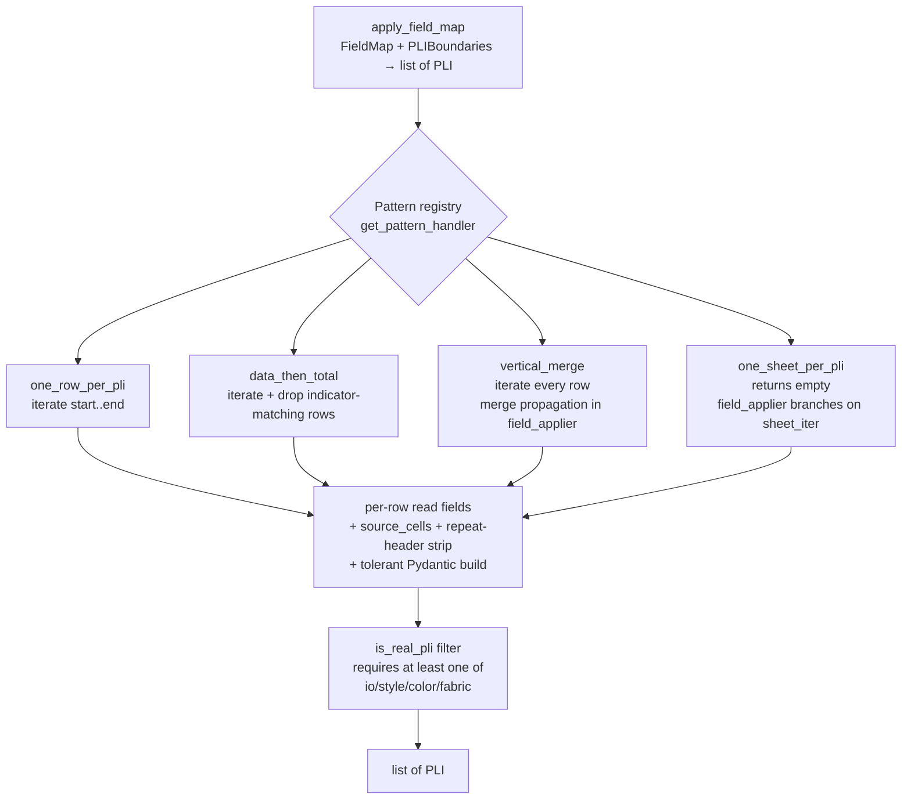
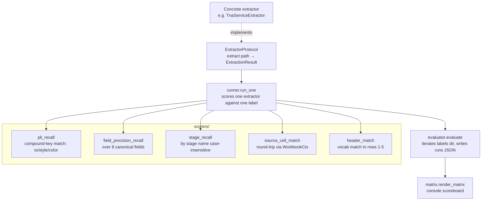
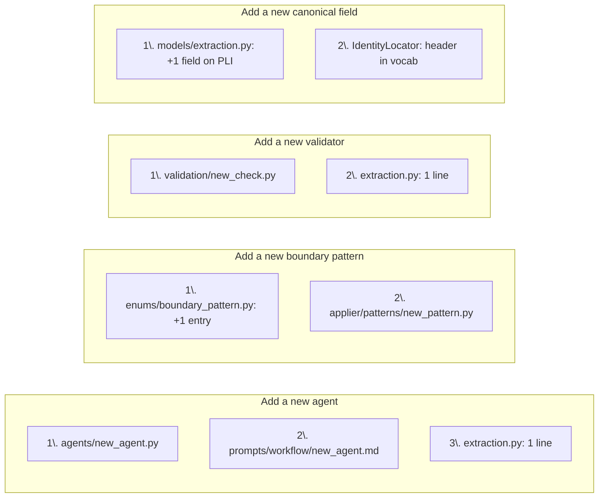

# Architecture — TNA Service

> This document covers the **inside** of the microservice. For installation, API, and operations, see [`README.md`](./README.md).

---

## Contents

1. [Glossary](#glossary)
2. [Design principles](#design-principles)
3. [Layered structure](#layered-structure)
4. [High-level topology](#high-level-topology)
5. [The seven phases](#the-seven-phases)
6. [Bridge artifacts (data flow)](#bridge-artifacts-data-flow)
7. [Agent inventory](#agent-inventory)
8. [Validation arm](#validation-arm)
9. [Applier & pattern registry](#applier--pattern-registry)
10. [Reconciler](#reconciler)
11. [Eval framework](#eval-framework)
12. [Telemetry](#telemetry)
13. [Configuration & logging](#configuration--logging)
14. [Locked design decisions (D1–D10)](#locked-design-decisions-d1d10)
15. [Extension points](#extension-points)

---

## Glossary

| Term | Meaning |
|---|---|
| **TNA** | Time-and-Action sheet — a production schedule with planned dates + quantities per stage. |
| **PLI** | Production Line Item — one unique combination of style + color + fabric in a TNA. Each PLI carries an `io_number`, identity fields, a delivery date, a quantity, and a list of stages. |
| **IO Number** | Internal Order number. A single TNA file can hold many PLI rows, each with its own IO. |
| **Stage** | A production milestone (e.g. *Trims Inhouse*, *Sewing*, *Inspection*) with a planned date and optional sub-fields (actual, end, qty). |
| **Boundary Pattern** | How PLIs are laid out in a sheet — one of `one_row_per_pli`, `one_sheet_per_pli`, `vertical_merge`, `data_then_total`. Drives applier dispatch. |
| **Stage Layout Mode** | How a stage's sub-fields appear — `wide_sub_columns` (Plan/Actual to the right) or `tall_sub_rows` (Plan/Action/Deviation stacked beneath). |
| **Bridge Artifact** | Pydantic data class that flows between LLM agents and deterministic Python. Inspector emits a `StructuralFingerprint`, BoundaryFinder emits `PLIBoundaries`, etc. |
| **Source cells** | Per-PLI traceability map: `{"io_number": "K4", "delivery_date": "P4"}`. Lets a reviewer open the workbook and verify any extracted value at its origin. |

---

## Design principles

1. **Structural-signal routing, not supplier names.** The orchestrator never branches on "if Compass Pro" — it branches on `has_vertical_merges_in_data`, `multi_band_stages_per_pli`, and so on. This is what makes adding a new supplier a no-op.

2. **Induction then apply.** LLM agents *induce* locations and patterns from samples (cheap, one prompt per agent). Deterministic Python *applies* those locations to every PLI row (zero LLM tokens per PLI, fully reproducible).

3. **Faithful extraction.** What the source cell holds is what we emit — no splitting, no trimming, no inference of missing data. Confidence scores express uncertainty; values stay verbatim.

4. **Parallel validation arm.** Workflow extracts; validation independently asks "does this match the source?" Two arms, one reconciler.

5. **Incremental adaptability is the headline NFR.** Every axis along which a new TNA family can differ — layout shape, canonical field, header vocabulary, non-PLI row pattern — has its own additive extension point. See [Extension points](#extension-points).

6. **Observable from day 1.** Prometheus collectors per agent, per validator, per phase. The Grafana dashboard ships with the service.

---

## Layered structure



**Why this layering matters:** the orchestrator never imports from `routers/`. The validators never import from `services/agents/`. The eval framework imports only `app/models/*` and `evals/interface.py`. Coupling is one-way: HTTP → services → repositories → models → enums.

---

## High-level topology

The orchestrator runs two arms in parallel — workflow extracts, validation checks — and the reconciler merges their outputs.



**Two arms, one reconciler.** Workflow output flows to the reconciler unchanged. Validation findings attach as `Warning` entries. Extraction confidence is recomputed from a weighted blend (workflow's self-reported confidence + validation pass rate).

---

## The seven phases

The orchestrator's `extract(workbook_path)` runs these phases in order. Each phase has a deterministic contract: known inputs, known outputs, known failure handling.



**Per-sheet loop semantics.** Phases 2–5 run once per TNA-relevant sheet. When BoundaryFinder emits `pattern == one_sheet_per_pli`, the applier already iterates `sheet_iter` internally — so we **break out of the outer loop** (decision D3) to avoid producing 5×5=25 duplicate PLIs.

**Failure handling per phase (D6 — tiered):**

| Phase | If the agent fails | What happens |
|---|---|---|
| 1 SheetClassifier | fallback | Include all sheets (false positives are cheap) |
| 2 LayoutFingerprinter | fallback | Conservative default fingerprint, log warning |
| 3 BoundaryFinder | fallback | Default `one_row_per_pli` boundary, log warning |
| 4 any locator | fallback | Empty `FieldMap` / `StageBandSet`, log warning |
| 5 Applier | never fails | Deterministic; if any field's `FlexibleDate` rejects a value, that field is dropped from the PLI (the PLI itself survives) |
| 6 any validator | skip that check | Other checks continue |

---

## Bridge artifacts (data flow)

The contracts between LLM agents and deterministic Python are Pydantic models in `app/models/artifacts.py`. Each one is a typed envelope that the orchestrator passes around.

```mermaid
flowchart LR
    WK[WorkbookCtx]

    subgraph PHASE1["Phase 1"]
      SC[SheetClassifier]
      WK --> SC
      SC --> RL[relevant_sheets: list str]
    end

    subgraph PHASE2["Phase 2 — per sheet"]
      LF[LayoutFingerprinter]
      RL --> LF
      LF --> SF[StructuralFingerprint]
    end

    subgraph PHASE3["Phase 3 — per sheet"]
      BF[BoundaryFinder]
      SF --> BF
      BF --> PB[PLIBoundaries]
    end

    subgraph PHASE4["Phase 4 — per sheet, parallel"]
      IL[IdentityLocator]
      QDL[QuantityDateLocator]
      SL[StageLocator]
      PB --> IL
      PB --> QDL
      PB --> SL
      IL --> FM1[FieldMap identity]
      QDL --> FM2[FieldMap qty/date]
      SL --> SBS[StageBandSet]
    end

    subgraph PHASE5["Phase 5 — apply"]
      MERGE[merge field maps + dedup]
      FM1 --> MERGE
      FM2 --> MERGE
      SBS --> MERGE
      MERGE --> APPLY[Applier]
      APPLY --> PLIs[list of PLI<br/>with stages + source_cells]
    end

    subgraph PHASE6["Phase 6 — validate"]
      PLIs --> V1[SourceCellVerifier]
      PLIs --> V2[HeaderMatchVerifier]
      PLIs --> V3[CoverageVerifier]
      PLIs --> V4[FieldDropoutVerifier]
      V1 --> VF[ValidationFindings]
      V2 --> VF
      V3 --> VF
      V4 --> VF
    end

    subgraph PHASE7["Phase 7 — reconcile"]
      PLIs --> RC[reconcile]
      VF --> RC
      RC --> ER[ExtractionResult]
    end
```



**Artifact schemas (all `Pydantic`, all `extra='ignore'` for forward-compat):**

| Artifact | Key fields |
|---|---|
| `WorkbookSummary` | `sheet_count`, `sheet_names`, `file_size_kb` |
| `StructuralFingerprint` | 9 booleans (`sheets_appear_parallel`, `has_vertical_merges_in_data`, `multi_band_stages_per_pli`, ...) + `stage_layout_mode` + `sample_evidence` |
| `PLIBoundaries` | `pattern: BoundaryPattern`, `data_start_row`, `data_end_row`, `grouping_columns`, `total_row_indicator_col/value`, `sheet_iter` |
| `FieldLocation` | `field`, `pattern: LocationPattern`, `column` / `anchor_cell`+`value_offset_rc` |
| `FieldMap` | `locations: list[FieldLocation]`, `metadata_locations: list[PLIMetadataLocation]` |
| `StageColumn` | `name` (canonical), `primary_col`, `sub_columns: dict` |
| `StageBand` | `section_name`, `layout_mode: StageLayoutMode`, `name_row`, `sub_header_row`/`sub_rows`, `stage_columns: list[StageColumn]` |
| `StageBandSet` | `sheet`, `bands: list[StageBand]` |
| `ValidationFinding` | `check`, `severity: ValidationSeverity`, `message`, `pli_index`, `field` |
| `ValidationFindings` | `findings: list[ValidationFinding]` + `warn_rate` property |

---

## Agent inventory

Six LLM-driven workflow agents. Each one is data-first: a frozen `AgentSpec` value (name, system prompt, output schema, `build_user_input` function) and a thin Haystack `@component` wrapper that delegates to `AgentRunner`. The runner handles retry-with-error-context on Pydantic validation failures.

| # | Agent | Single decision | Output |
|---|---|---|---|
| 1 | **SheetClassifier** | Which sheets are TNA-relevant? | `relevant_sheets: list[str]` |
| 2 | **LayoutFingerprinter** | What structural patterns describe this sheet? | `StructuralFingerprint` |
| 3 | **BoundaryFinder** | How are PLIs organised? | `PLIBoundaries` |
| 4 | **IdentityLocator** | Where do io / style / color / fabric live? | `FieldMap.locations[identity]` + metadata |
| 5 | **QuantityDateLocator** | Where do quantity / delivery_date live? | `FieldMap.locations[qty,date]` + metadata |
| 6 | **StageLocator** | What are the stage bands and their canonical names? | `StageBandSet` |

**Retry semantics (D5):** every agent retries once on Pydantic `ValidationError`, with the validation error message appended to the user prompt as context. After the retry, `AgentRunFailure` is *returned* (not raised) — the orchestrator decides whether to use a fallback or halt.

**Why these six (and not more):**
- Identity, qty/date, stage cuts at natural prompt boundaries — each agent has one decision and a focused vocabulary.
- Splitting *more* (e.g. one agent per canonical field) bloats orchestration without sharpening any single prompt.
- We considered an LLM `FieldReviewer` (second opinion on disputed columns) — **explicitly deferred to V2** until the deterministic validators demonstrably leave gaps.

---

## Validation arm

Four deterministic checks run in parallel after extraction completes. **No LLM in V1.**



| Check | Catches | Threshold |
|---|---|---|
| `source_cell` | Drift between extraction and source workbook value | exact-match string compare |
| `header_match` | Wrong column picked for a canonical field | column header (rows 1-5) must contain ≥1 vocab term |
| `coverage` | Silent under-extraction (boundary too narrow, or applier rejected most rows) | extracted PLI count < 80% of candidate rows |
| `field_dropout` | A canonical field is missing across most PLIs | < 50% of PLIs have that field populated |

Findings flow into the reconciler as `Warning` entries on the final result — V1 never auto-drops anything, just attaches.

---

## Applier & pattern registry

The applier is pure deterministic Python. Pattern dispatch is registry-based — adding a new boundary pattern is one file in `app/services/applier/patterns/` plus a `@pattern_handler` decorator.



**Defensive layers built into the applier:**

| Layer | What it does | Pattern bug it caught |
|---|---|---|
| Pattern registry | Dispatches row iteration per `BoundaryPattern` | clean separation; no `if/elif` chains |
| Merge propagation | For `vertical_merge`, a sub-row inherits its identity from the merge anchor | Multi-color sub-rows in Compass Pro |
| Repeat-header strip | If a row's canonical field value matches a known header label, identity is cleared | Stacked sub-tables in NORTHERN REFLECTIONS |
| `is_real_pli` filter | Drops rows with no canonical identity at all | Totals rows, banners, blank rows |
| Tolerant Pydantic build | Drops fields that fail validation; preserves the rest of the PLI | DD-MMM-YYYY dates that fail FlexibleDate |
| `source_cells` recording | A1 address per field, for downstream verification | Foundation of `SourceCellVerifier` |

**Stage dedup helper:** `strip_stage_columns_from_metadata(field_map, stage_set)` removes any PLI-metadata location whose column is already claimed by a `StageColumn.primary_col` or `sub_columns`. Prevents `Sewing Qty` from appearing as both `Stage.metadata.qty` *and* `PLI.metadata.sewing_qty`.

---

## Reconciler

V1 is **lenient** — workflow output passes through unchanged; validation findings attach as `Warning` entries; `extraction_confidence` is recomputed.

```python
extraction_confidence = 0.7 * mean(workflow_per_field_confidence)
                     + 0.3 * (1 - validator_warn_rate)
```

Strict mode (auto-drop fields that any validator flags) is a deferred V2 flag.

---

## Eval framework

The eval module is **architecturally independent** of `app/services/*` and `app/routers/*`. It imports only `app/models/*` and the `ExtractorProtocol`. Any extractor — today's microservice, a future rewrite, a mock — plugs in by satisfying that one interface.



**`make eval`** runs `scripts/run_eval.py` which:
1. Wires `TnaServiceExtractor(orchestrator.extract)` as the `ExtractorProtocol`
2. Iterates every JSON in `evals/labels/` (symlink to `../dataset/extracted/`)
3. For each one, opens the corresponding xlsx, runs extraction, scores 6 metrics, records an `EvalRow`
4. Writes the full run to `evals/runs/<utc-timestamp>.json` and prints the matrix to stdout

The matrix prints numbers only (no diff column) by design — diffs are computed externally by comparing two `evals/runs/*.json` files.

---

## Telemetry

Eight Prometheus collectors expose runtime behaviour at `/metrics`.

| Collector | Type | Labels | Emitted by |
|---|---|---|---|
| `extraction_duration_seconds` | Histogram | `format_detected` | orchestrator end-of-run |
| `extraction_pli_count` | Gauge | `source_file` | orchestrator end-of-run |
| `agent_duration_seconds` | Histogram | `agent` | `AgentRunner` per successful run |
| `agent_retry_count` | Counter | `agent`, `reason` | `AgentRunner` per retry |
| `agent_tokens_input` | Counter | `agent`, `model` | (reserved — wired through `AnthropicProvider` extension) |
| `agent_tokens_output` | Counter | `agent`, `model` | (reserved — same) |
| `validator_findings` | Counter | `check`, `severity` | each validator on every emitted finding |
| `llm_inference_duration_seconds` | Histogram | `model` | `AnthropicProvider.complete_with_schema` |

The Grafana dashboard provisioned at startup uses these to show: extraction latency p95, agent retry rates, validator finding rates, PLIs-per-file time series.

---

## Configuration & logging

**Config** (`app/config/settings.py`) is a `pydantic-settings` singleton accessed via `get_settings()`. Env files are layered: `.env.{APP_ENV}.local > .env.{APP_ENV} > .env.local > .env`. Environment-aware behaviour:
- `development` → human-readable console log output, no JSON
- `production` / `staging` / `test` → JSON-line log output, ISO timestamps, level field

**Logging** (`app/core/logs.py`) uses `structlog`. The `RequestIdMiddleware` binds an `X-Request-ID` (echoed or generated) into structlog's contextvars so every log line during a request carries it. Grep by `request_id` to follow one extraction through agents, validators, and reconciler.

---

## Locked design decisions (D1–D10)

These were nailed down during the brainstorming session. Re-opening any of them needs an ADR.

| # | Decision | Locked | Rationale |
|---|---|---|---|
| **D1** | Per-sheet parallelism in Phases 2–5 | sequential V1 | Most labeled files are 1–3 sheets; rate-limit risk; simpler error handling |
| **D2** | Within-sheet locator parallelism | all 3 in parallel | All 3 consume `PLIBoundaries` only; independent shards; ~3× faster Phase 4 |
| **D3** | Fast-path for `one_sheet_per_pli` | yes, branch after fingerprint | Eliminates 5×5=25-duplicate class structurally |
| **D4** | Validation timing | after all sheets aggregated | Cross-sheet context; simpler than per-sheet merge |
| **D5** | Retry policy | 1 retry with error context | Empirically fixes most JSON-as-string artifacts on first retry |
| **D6** | Agent failure handling | tiered (halt on fingerprint, fallback on others) | Partial output is more useful than no output |
| **D7** | Adaptive routing on fingerprint | no skip-list V1 | Today's agents are universal; skip-optimisation is YAGNI |
| **D8** | Cross-sheet PLI aggregation | concatenate, preserve `source_sheet`, no dedup | Different sheets genuinely hold different PLIs |
| **D9** | Phase 5 determinism gates | both `is_real_pli` AND repeat-header detection | Each catches a different class of false-PLI |
| **D10** | Telemetry granularity | per-phase + per-agent + per-validator | Lets us correlate prompt changes to behaviour |

---

## Extension points

Adding new things should be small contained changes. This matrix is enforced by `tests/integration/test_acceptance_extensibility.py`.

| New thing arrives | Files you touch | Files you do **not** touch |
|---|---|---|
| **New layout shape** (e.g. `horizontal_merge`, `multi_section`) | 1× enum entry in `app/enums/boundary_pattern.py` + 1× file in `app/services/applier/patterns/<name>.py` | all agents, validators, eval, orchestrator |
| **New canonical field** on `PLI` | 1× field on `PLI` Pydantic + 1× line in `IdentityLocator` (or new sibling locator) | all existing extraction; eval auto-picks the field up |
| **New non-PLI row pattern** | 1× deterministic check under `app/services/validation/` | workflow agents |
| **New supplier header vocabulary** | 1× term in the validator's `_VOCAB` dict | all agents |
| **New tool** | 1× `@tool`-decorated function under `app/repositories/workbook_tools/` | agents that don't need it |
| **New agent** | 1× file under `app/services/agents/` + 1× prompt in `app/prompts/workflow/` | other agents; orchestrator hard-coded list (just one connection to add) |
| **New validator** | 1× file under `app/services/validation/` + 1× wire-up in orchestrator | workflow side; reconciler |
| **New labeled file (no rule change)** | drop JSON in `../dataset/extracted/` | nothing else — eval auto-picks it up |



If a PR touches more than two columns of the matrix above, that's a yellow flag in review — the architecture is intended to make routine extensions cheap.

---

## Reading order for new contributors

1. [`README.md`](./README.md) — install + run + API + Make targets
2. This file — sections 1–6 (definitions, principles, layered structure, topology, phases, artifacts)
3. `app/services/extraction.py` — the orchestrator, top-to-bottom
4. One workflow agent in full: `app/services/agents/identity_locator.py` + `app/prompts/workflow/identity_locator.md`
5. `app/services/applier/field_applier.py` — the deterministic side
6. `tests/integration/test_acceptance_extensibility.py` — the structural contract
