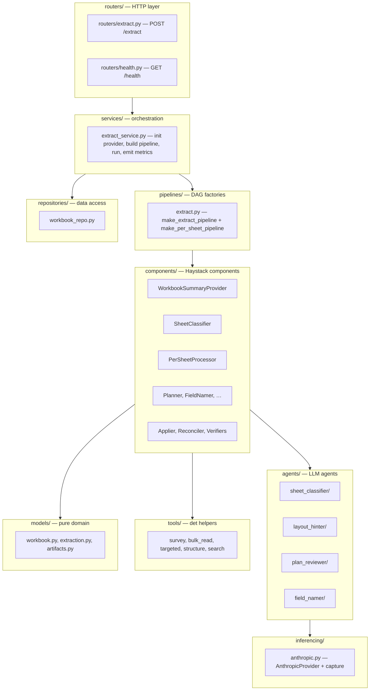
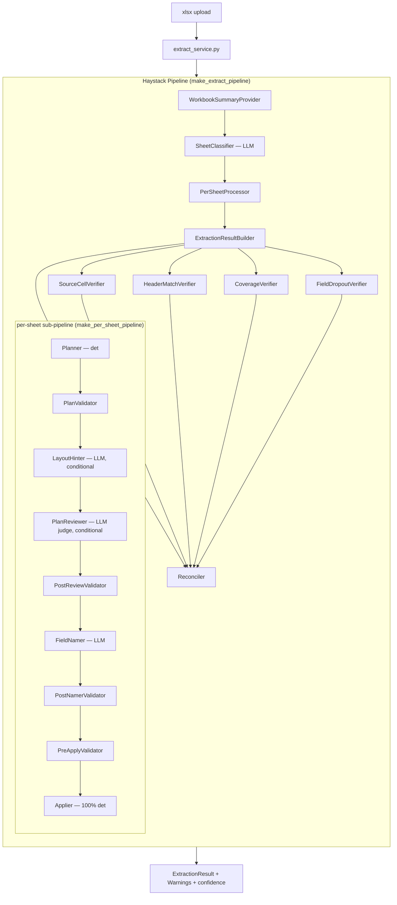
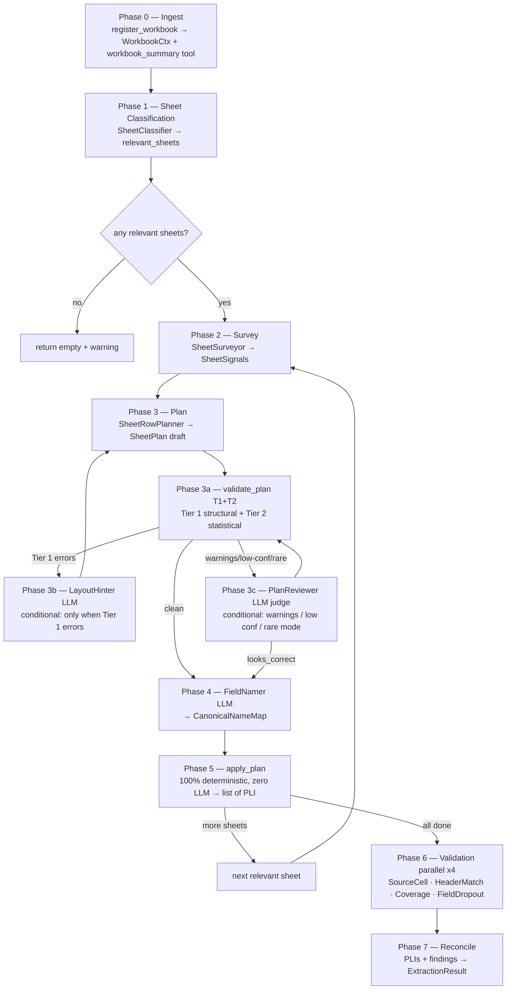
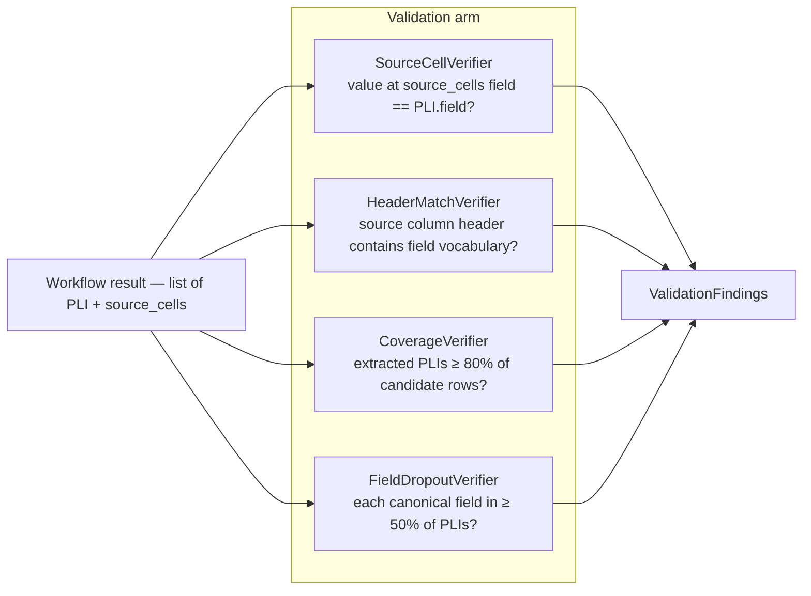
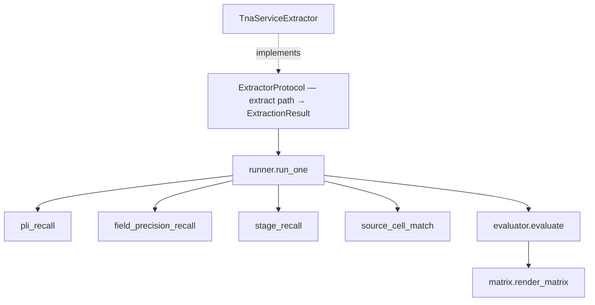

# Architecture — TNA Service

> This document covers the **inside** of the microservice. For installation, API, and operations, see [`README.md`](./README.md).

---

## Contents

1. [Glossary](#glossary)
2. [Design principles](#design-principles)
3. [Three-layer separation](#three-layer-separation)
4. [Seven framework primitives](#seven-framework-primitives)
5. [High-level topology](#high-level-topology)
6. [The pipeline phases](#the-pipeline-phases)
7. [Bridge artifacts (data flow)](#bridge-artifacts-data-flow)
8. [Agent inventory](#agent-inventory)
9. [Validation arm](#validation-arm)
10. [SheetRowPlanner & apply_plan](#sheetrowplanner--apply_plan)
11. [Reconciler](#reconciler)
12. [Eval framework](#eval-framework)
13. [Telemetry](#telemetry)
14. [Configuration & logging](#configuration--logging)
15. [Locked design decisions (D1–D10)](#locked-design-decisions-d1d10)
16. [Extension points](#extension-points)

---

## Glossary

| Term | Meaning |
|---|---|
| **TNA** | Time-and-Action sheet — a production schedule with planned dates + quantities per stage. |
| **PLI** | Production Line Item — one unique combination of style + color + fabric in a TNA. Each PLI carries an `io_number`, identity fields, a delivery date, a quantity, and a list of stages. |
| **IO Number** | Internal Order number. A single TNA file can hold many PLI rows, each with its own IO. |
| **Stage** | A production milestone (e.g. *Trims Inhouse*, *Sewing*, *Inspection*) with a planned date and optional sub-fields (actual, end, qty). |
| **PLI scope** | How PLIs are laid out in a sheet — one of `ROW_PER_PLI`, `SECTION_PER_PLI`, or `SHEET_IS_PLI`. |
| **Stage scope** | Where stage band definitions live — `SHEET_LEVEL` (shared across all PLIs), `SECTION_LOCAL` (per PliBlock), or `PLI_LOCAL` (embedded inside a SHEET_IS_PLI block). |
| **PLI height** | Whether each PLI occupies a single data row (`SINGLE_ROW`) or multiple stacked sub-rows (`MULTI_ROW`) with roles PLAN / ACTION / ACTUAL / DEVIATION. |
| **SheetPlan** | The unified artifact produced by SheetRowPlanner and consumed verbatim by `apply_plan`. Encodes all three axes above plus row-level `RowSpec` classifications. |
| **SheetSignals** | Raw structural signals emitted by SheetSurveyor — merged regions, row-type distribution, header vocabulary, dtype profiles — passed to SheetRowPlanner. |
| **Bridge Artifact** | Pydantic data class that flows between LLM agents and deterministic Python. SheetRowPlanner emits `SheetPlan`; FieldNamer emits `CanonicalNameMap`. |
| **Source cells** | Per-PLI traceability map: `{"io_number": "K4", "delivery_date": "P4"}`. Lets a reviewer open the workbook and verify any extracted value at its origin. |

---

## Design principles

1. **Structural-signal routing, not supplier names.** The pipeline never branches on "if Compass Pro" — it branches on `has_vertical_merges_in_data`, `multi_band_stages_per_pli`, and so on. This is what makes adding a new supplier a no-op.

2. **Induction then apply.** LLM agents *induce* locations and patterns from samples (cheap, one prompt per agent per sheet). Deterministic Python *applies* those locations to every PLI row (zero LLM tokens per PLI, fully reproducible).

3. **Faithful extraction.** What the source cell holds is what we emit — no splitting, no trimming, no inference of missing data. Confidence scores express uncertainty; values stay verbatim.

4. **Parallel validation arm.** Workflow extracts; validation independently asks "does this match the source?" Two arms, one reconciler.

5. **Incremental adaptability is the headline NFR.** Every axis along which a new TNA family can differ — layout shape, canonical field, header vocabulary, non-PLI row pattern — has its own additive extension point. See [Extension points](#extension-points).

6. **Observable from day 1.** Traces, metrics, and logs flow over OTLP into a SigNoz stack that comes up with `docker compose up`. Every LLM call's prompt + response is queryable by `trace_id`.

---

## Coding standard

The codebase follows `docs/CODING_STANDARD.md` — Python-specific rules for naming, docstrings, function decomposition, type hints, error handling, imports, module organisation, and the seven framework primitives (§11). Section 10 is the master checklist a reviewer or AI agent runs against any changed file before commit.

---

## Three-layer separation

```
app/routers/extract.py           HTTP boundary — FastAPI route, file upload, HTTP errors
        ↓  calls
app/services/extract_service.py  Orchestration service — init provider, build pipeline,
                                  assemble inputs, run pipeline, emit telemetry
        ↓  uses
app/pipelines/extract.py         Pure DAG factories — make_per_sheet_pipeline +
                                  make_extract_pipeline; no business logic
```

The service is the only place that touches `AnthropicProvider.from_env()`,
`TOOL_REGISTRY`, and telemetry counters. The pipeline factories are pure:
given an `llm` and a `ctx`, they return a wired `Pipeline` and nothing else.
The router delegates entirely to the service and handles only HTTP concerns.

See ADR-0007 for the rationale.

---

## Seven framework primitives

Each primitive has a single home and a single responsibility. `docs/CODING_STANDARD.md §11` has the full rule set.

| Primitive | Home | Role |
|---|---|---|
| **pipeline** | `app/pipelines/<name>.py` | Top-level Haystack `Pipeline`. `add_component()` + `connect()` edges. No business logic. |
| **component** | `app/components/<name>.py` | Unit the pipeline calls. `@component`-decorated, typed I/O. Deterministic or LLM-backed (wraps an agent). |
| **agent** | `app/agents/<name>/` | One narrow LLM mapping job. Folder: `agent.py`, `schema.py`, `tuning.py`, `validators.py`. |
| **tool** | `app/tools/<name>.py` | Deterministic, side-effect-free helper. `@tool`-decorated. |
| **inferencing** | `app/inferencing/<provider>.py` | Single LLM-call boundary. Owns retry, train-of-thought capture, provider SDK. |
| **prompts** | `app/prompts/<name>.py` | One module per prompt; one uppercase `str` constant. |
| **tuning_params** | `app/agents/<name>/tuning.py` + `app/pipelines/tuning.py` | `pydantic-settings` blocks for per-agent and per-pipeline knobs. |



---

## High-level topology

The service builds a Haystack Pipeline (a DAG). The per-sheet sub-pipeline
(planner → validators → FieldNamer → Applier) runs inside `PerSheetProcessor`.
Four verifiers run in parallel after all sheets are aggregated; the Reconciler
merges the results.



**LLM-as-judge pattern.** Deterministic Python produces the `SheetPlan`; LLM
agents critique it (`PlanReviewer`) and fill in vocabulary mapping (`FieldNamer`).
Row arithmetic stays out of the LLM. In the median case only one LLM call occurs
per sheet (`FieldNamer`); `LayoutHinter` and `PlanReviewer` are conditional on
plan quality signals.

---

## The pipeline phases

Phases 2–5 run once per TNA-relevant sheet (parallel across sheets is allowed in
a future version). Phases 6–7 run once after all sheets are aggregated.



**Per-sheet loop semantics.** Phases 2–5 run once per TNA-relevant sheet.
`apply_plan` dispatches on `pli_mode` (ROW_PER_PLI / SECTION_PER_PLI /
SHEET_IS_PLI) — every mode handles its own sheet boundary naturally.

**Failure handling per phase:**

| Phase | If the component/agent fails | What happens |
|---|---|---|
| 1 SheetClassifier | fallback | Include all sheets (false positives are cheap) |
| 2 SheetSurveyor | fallback | Minimal SheetSignals, log warning |
| 3 SheetRowPlanner | fallback | Default ROW_PER_PLI plan, log warning |
| 3a validate_plan | never fails | Always returns findings (possibly empty) |
| 3b LayoutHinter | skip | Proceed with original plan + re-plan attempt |
| 3c PlanReviewer | skip, log telemetry | Proceed with plan as-is |
| 4 FieldNamer | fallback | Empty CanonicalNameMap (identity fields still extractable) |
| 5 apply_plan | never fails | Missing cell/row → Warning on ExtractionResult (PLI skipped) |
| 6 any validator | skip that check | Other checks continue |

---

## Bridge artifacts (data flow)

The contracts between LLM agents and deterministic Python are Pydantic models
in `app/models/artifacts.py`. Each one is a typed envelope passed between
components via the Haystack Pipeline's output dict.

**Artifact schemas (all `Pydantic`, all `extra='ignore'` for forward-compat):**

| Artifact | Key fields |
|---|---|
| `WorkbookSummary` | `sheet_count`, `sheet_names`, `file_size_kb` |
| `SheetSignals` | merged regions, row-type distribution, header vocabulary, dtype profiles, sample rows |
| `RowSpec` | `idx`, `role: RowRole`, `anchor_idx`, `group_id`, `sub_row_role: SubRowRole \| None` |
| `HeaderLabel` | `raw`, `col`, `row`, `confidence` |
| `KVAnchor` | `label_cell`, `value_cell`, `field`, `confidence: float = 0.95` |
| `StageColumn` | `name`, `name_cell`, `primary_col`, `sub_columns: dict[str, str]` |
| `StageBandSpec` | `name`, `name_cell`, `sub_header_row`, `stage_columns: list[StageColumn]`, `layout_mode` |
| `PliBlock` | `id`, `bbox`, `identity: list[KVAnchor]`, `stage_bands: list[StageBandSpec]` |
| `SheetPlan` | `sheet`, `pli_mode`, `stage_scope`, `header_rows`, `header_labels`, `rows`, `pli_blocks`, `kv_anchors`, `stage_bands`, `confidence` |
| `CanonicalNameMap` | `field_aliases`, `stage_name_map`, `stage_subfield_labels`, `field_confidence`, `stage_confidence` |
| `LayoutHints` | hints from LayoutHinter for the re-planning loop |
| `PlanVerdict` | `verdict: looks_correct \| needs_fix`, row corrections, warnings, confidence |
| `ValidationFinding` | `check`, `severity`, `message`, `pli_index`, `field` |

---

## Agent inventory

Four LLM-driven agents are in the workflow; two are conditional. Each agent
lives in `app/agents/<name>/` and inherits `Agent` from `app/agents/_base.py`.
The `Agent` base provides lifecycle hooks (`validate_input`, `validate_output`,
`before_run`, `after_run`, `on_retry`) that return typed `InputVerdict` /
`OutputVerdict` values.

| # | Agent | Role | Fires when | Output |
|---|---|---|---|---|
| 1 | **SheetClassifier** | Filter | always | `relevant_sheets: list[str]` |
| 2 | **LayoutHinter** | Re-plan hint | Tier 1 errors in `validate_plan` | `LayoutHints` |
| 3 | **PlanReviewer** | LLM judge | Tier 1/2 warnings, `confidence < 0.85`, or rare `pli_mode` | `PlanVerdict` |
| 4 | **FieldNamer** | Vocabulary mapping | after plan is accepted | `CanonicalNameMap` |

**Why four agents (and not more):** row arithmetic and structural classification
belong in deterministic Python (`SheetRowPlanner`). Vocabulary mapping and plan
critique are exactly where LLM judgment adds value.

**Deterministic components** (no LLM calls):

| Component | Role | Output |
|---|---|---|
| **SheetSurveyor** | Structural signal extraction | `SheetSignals` |
| **SheetRowPlanner** | Plan induction from signals | `SheetPlan` |
| **validate_plan** (T1+T2) | Invariant + statistical checks | `ValidationFindings` |
| **apply_plan** | 100% LLM-free PLI emission | `list[PLI]` |

---

## Validation arm

Four deterministic checks run after extraction completes. No LLM in V1.



| Check | Catches | Threshold |
|---|---|---|
| `source_cell` | Drift between extraction and source workbook value | exact-match string compare |
| `header_match` | Wrong column picked for a canonical field | column header (rows 1-5) must contain ≥1 vocab term |
| `coverage` | Silent under-extraction | extracted PLI count < 80% of candidate rows |
| `field_dropout` | A canonical field missing across most PLIs | < 50% of PLIs have that field populated |

---

## SheetRowPlanner & apply_plan

### Three orthogonal axes

`SheetPlan` encodes three independent dimensions of layout variation.

| Axis | Values |
|---|---|
| PLI scope | `ROW_PER_PLI` · `SECTION_PER_PLI` · `SHEET_IS_PLI` |
| Stage scope | `SHEET_LEVEL` · `SECTION_LOCAL` · `PLI_LOCAL` |
| PLI height | `SINGLE_ROW` · `MULTI_ROW` |

### Channel ↔ mode matrix (ADR-0006)

Each `pli_mode` has a dedicated identity channel. `FieldNamer` and `apply_plan`
read from this channel symmetrically.

| Mode | Identity channel | Stage channel |
|---|---|---|
| `ROW_PER_PLI` | `header_labels` | `stage_bands[].stage_columns` |
| `SHEET_IS_PLI` | `kv_anchors` | `stage_bands[].stage_columns` |
| `SECTION_PER_PLI` | `pli_blocks[].identity` | `pli_blocks[].stage_bands[].stage_columns` |

### apply_plan — locked contract

`apply_plan` is the pure resolver from `SheetPlan + CanonicalNameMap → list[PLI]`.

**Locked invariants:**

| Invariant | Rule |
|---|---|
| 100% deterministic | Same inputs → identical outputs on every run |
| Zero LLM calls | Not directly, not indirectly, not via fallback paths |
| No silent fallbacks | Missing cell/row → Warning on ExtractionResult (PLI skipped) |
| Enum-only dispatch | Switches on `pli_mode`, `stage_scope`, `RowSpec.role`; no string matching |
| source_cells recorded | A1 address per field on every PLI |

---

## Reconciler

V1 is **lenient** — workflow output passes through unchanged; validation findings
attach as `Warning` entries; `extraction_confidence` is recomputed.

```python
extraction_confidence = 0.7 * mean(workflow_per_field_confidence)
                     + 0.3 * (1 - validator_warn_rate)
```

---

## Eval framework

The eval module is **architecturally independent** of `app/services/*` and
`app/routers/*`. It imports only `app/models/*` and `ExtractorProtocol`.



`make eval` runs `scripts/run_eval.py`, wires `extract_service.extract` as the
`ExtractorProtocol`, scores 6 metrics per file, writes
`evals/runs/<utc-timestamp>.json`, and prints the matrix.

---

## Observability

For train-of-thought capture — spans, events, structured logs, SigNoz queries,
and how to read a trace — see [`docs/observability.md`](./docs/observability.md).

## Telemetry

All observability flows over OTLP gRPC (`OTEL_EXPORTER_OTLP_ENDPOINT`) into the
vendored SigNoz stack. Service name: `tna-service`.

**Metric names:**

| Metric | Type | Key attributes |
|---|---|---|
| `extractions_total` | Counter | `status` |
| `extraction_duration_seconds` | Histogram | `format_detected` |
| `extraction_pli_count` | Gauge | `source_file` |
| `agent_calls_total` | Counter | `agent`, `status` |
| `agent_duration_seconds` | Histogram | `agent` |
| `agent_retry_count` | Counter | `agent`, `reason` |
| `agent_tokens_input` | Counter | `agent`, `model` |
| `agent_tokens_output` | Counter | `agent`, `model` |
| `llm_calls_total` | Counter | `model`, `status` |
| `llm_inference_duration_seconds` | Histogram | `model` |
| `tool_calls_total` | Counter | `tool`, `status` |
| `tool_duration_seconds` | Histogram | `tool` |
| `validator_findings_total` | Counter | `check`, `severity` |

---

## Configuration & logging

**Config** (`app/config/settings.py`) is a `pydantic-settings` singleton accessed
via `get_settings()`. Environment-aware: `development` → human-readable console,
`production`/`staging`/`test` → JSON-line output.

**Logging** (`app/core/logs.py`) uses `structlog`. `RequestIdMiddleware` binds an
`X-Request-ID` into structlog's contextvars so every log line during a request
carries it.

---

## Locked design decisions (D1–D10)

| # | Decision | Locked | Rationale |
|---|---|---|---|
| **D1** | Per-sheet parallelism | sequential V1 | Most files are 1–3 sheets; rate-limit risk; simpler error handling |
| **D2** | LLM-as-judge pattern | det produces plan; LLM critiques + maps vocab | Row arithmetic is unreliable for LLMs; vocabulary mapping is exactly what they excel at |
| **D3** | `apply_plan` zero-LLM invariant | enforced by static analysis + test | Correctness is the planner's responsibility |
| **D4** | Extraction validator timing | after all sheets aggregated | Cross-sheet context; simpler than per-sheet merge |
| **D5** | Agent retry policy | 1 retry with error context | Empirically fixes most schema artifacts on first retry |
| **D6** | Agent failure handling | tiered (skip conditional agents, fallback on FieldNamer) | Partial output is more useful than no output |
| **D7** | Deterministic signals win on disagreement | PlanReviewer is advisory | Telemetry drives prompt improvement rather than overriding arithmetic |
| **D8** | Cross-sheet PLI aggregation | concatenate, preserve `source_sheet`, no dedup | Different sheets genuinely hold different PLIs |
| **D9** | Three-axis plan encoding | PLI scope × Stage scope × PLI height are orthogonal | Covers all observed families + future families |
| **D10** | Telemetry granularity | per-phase + per-agent + per-validator | Lets us correlate prompt changes to behaviour |

---

## Extension points

| New thing arrives | Files you touch | Files you do **not** touch |
|---|---|---|
| **New layout family** | Rules in planner sub-components | agents, validators, eval, pipeline factories, apply_plan |
| **New PLI scope / stage scope value** | 1× enum entry + 1× branch in `apply_plan` dispatch | planner sub-components, agents, validators |
| **New canonical field** on `PLI` | 1× field on `PLI` + `field_namer.md` vocab hint | all existing extraction; eval auto-picks it up |
| **New non-PLI row role** | 1× `RowRole` enum entry + rule in `row_classifier.py` | apply_plan (unknown roles produce a Warning) |
| **New LLM agent** | 1× folder under `app/agents/` + 1× prompt + 1× component + 1× wire in pipeline factory | other agents; service layer |
| **New extraction validator** | 1× file under `app/components/validators/` + 1× `add_component` + `connect` in pipeline factory | workflow side; reconciler |
| **New tool** | 1× `@tool`-decorated function under `app/tools/` | everything else |
| **New labeled file (no rule change)** | drop JSON + xlsx in `dataset/` | nothing else — eval auto-picks it up |
| **New pipeline architecture** | new `make_<x>_pipeline()` factory | service layer; router |

If a PR touches more than two columns of the matrix above, that's a yellow flag in review.

See ADR-0007 for the redesign rationale.

---

## Reading order for new contributors

1. [`README.md`](./README.md) — install + run + API + Make targets
2. This file — sections 1–7 (definitions, principles, three layers, primitives, topology, phases, artifacts)
3. `app/services/extract_service.py` — the orchestration service
4. `app/pipelines/extract.py` — the DAG factories
5. `app/components/per_sheet.py` — the per-sheet sub-pipeline wrapper
6. `app/agents/field_namer/agent.py` + `app/prompts/field_namer.py` — one full agent
7. `tests/unit/structure/test_layout.py` — the structural contract
