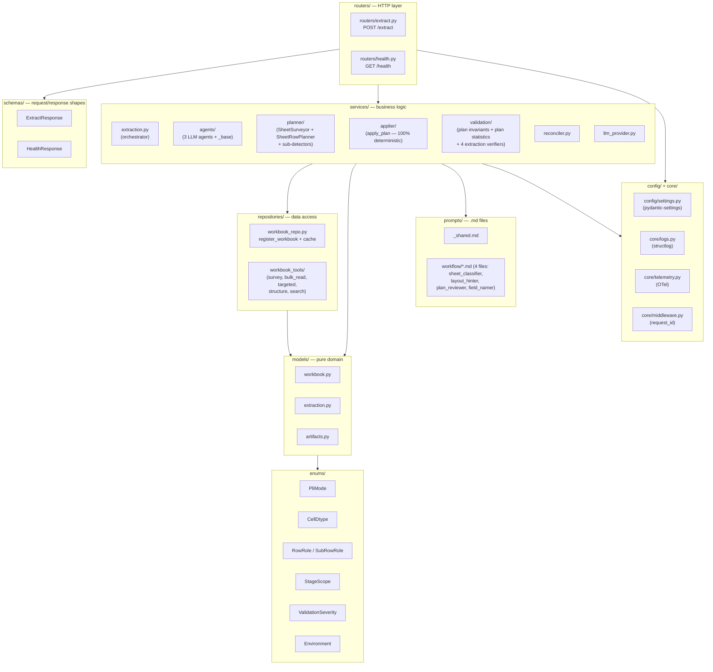
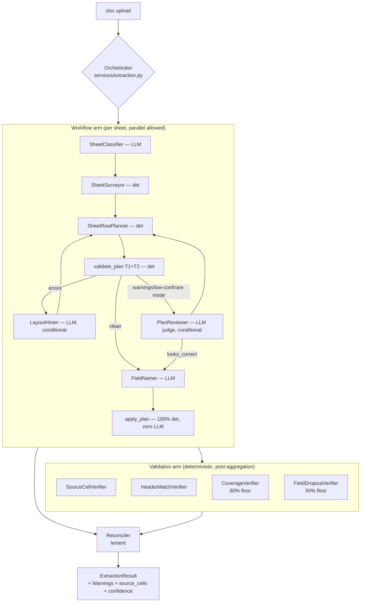
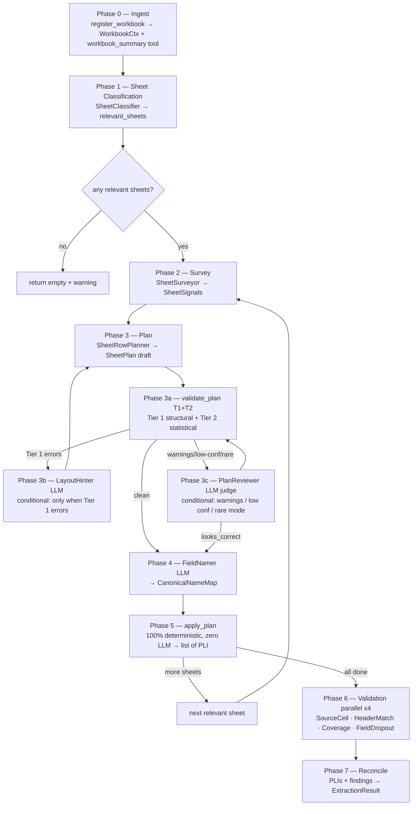
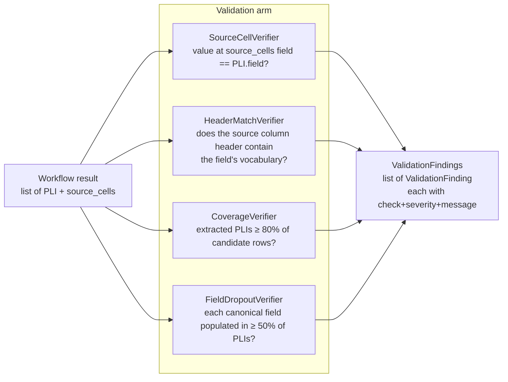
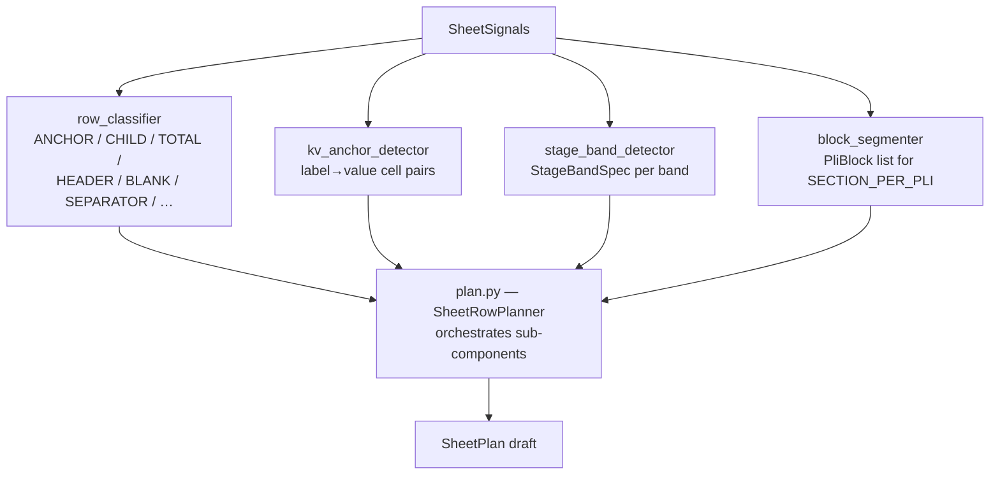
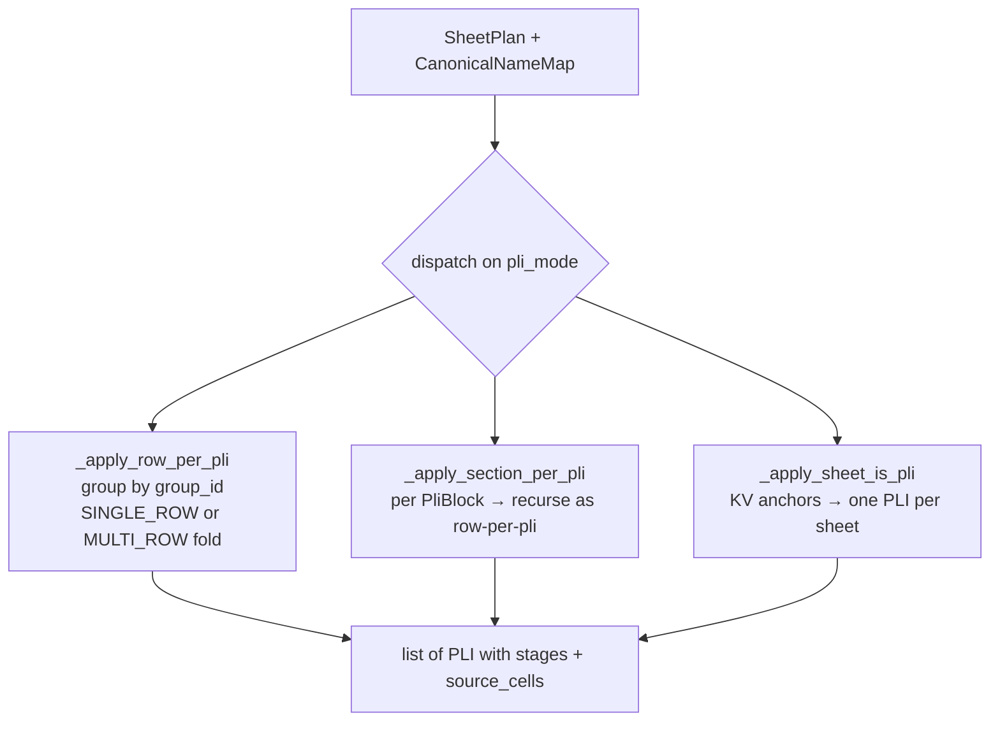
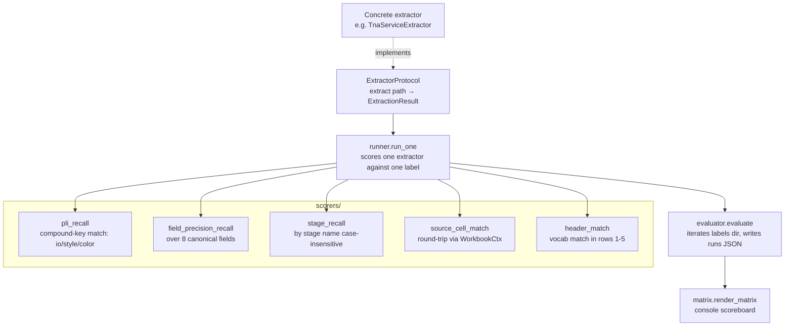
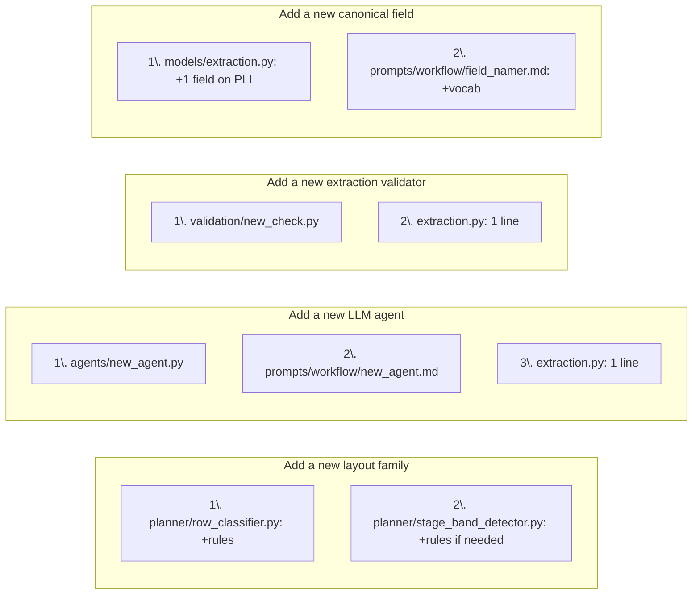

# Architecture — TNA Service

> This document covers the **inside** of the microservice. For installation, API, and operations, see [`README.md`](./README.md).

---

## Contents

1. [Glossary](#glossary)
2. [Design principles](#design-principles)
3. [Layered structure](#layered-structure)
4. [High-level topology](#high-level-topology)
5. [The pipeline phases](#the-pipeline-phases)
6. [Bridge artifacts (data flow)](#bridge-artifacts-data-flow)
7. [Agent inventory](#agent-inventory)
8. [Validation arm](#validation-arm)
9. [SheetRowPlanner & apply_plan](#sheetrowplanner--apply_plan)
10. [Reconciler](#reconciler)
11. [Eval framework](#eval-framework)
12. [Telemetry](#telemetry)
13. [Configuration & logging](#configuration--logging)
14. [Locked design decisions (D1–D10)](#locked-design-decisions-d1d10)
15. [Extension points](#extension-points)

---

## Glossary

| Term | Meaning |
|---|---|
| **TNA** | Time-and-Action sheet — a production schedule with planned dates + quantities per stage. |
| **PLI** | Production Line Item — one unique combination of style + color + fabric in a TNA. Each PLI carries an `io_number`, identity fields, a delivery date, a quantity, and a list of stages. |
| **IO Number** | Internal Order number. A single TNA file can hold many PLI rows, each with its own IO. |
| **Stage** | A production milestone (e.g. *Trims Inhouse*, *Sewing*, *Inspection*) with a planned date and optional sub-fields (actual, end, qty). |
| **PLI scope** | How PLIs are laid out in a sheet — one of `ROW_PER_PLI`, `SECTION_PER_PLI`, or `SHEET_IS_PLI`. |
| **Stage scope** | Where stage band definitions live — `SHEET_LEVEL` (shared across all PLIs), `SECTION_LOCAL` (per PliBlock), or `PLI_LOCAL` (embedded inside a SHEET_IS_PLI block). |
| **PLI height** | Whether each PLI occupies a single data row (`SINGLE_ROW`) or multiple stacked sub-rows (`MULTI_ROW`) with roles PLAN / ACTION / ACTUAL / DEVIATION. |
| **SheetPlan** | The unified artifact produced by SheetRowPlanner and consumed verbatim by `apply_plan`. Encodes all three axes above plus row-level `RowSpec` classifications. |
| **SheetSignals** | Raw structural signals emitted by SheetSurveyor — merged regions, row-type distribution, header vocabulary, dtype profiles — passed to SheetRowPlanner. |
| **Bridge Artifact** | Pydantic data class that flows between LLM agents and deterministic Python. SheetRowPlanner emits `SheetPlan`; FieldNamer emits `CanonicalNameMap`. |
| **Source cells** | Per-PLI traceability map: `{"io_number": "K4", "delivery_date": "P4"}`. Lets a reviewer open the workbook and verify any extracted value at its origin. |

---

## Design principles

1. **Structural-signal routing, not supplier names.** The orchestrator never branches on "if Compass Pro" — it branches on `has_vertical_merges_in_data`, `multi_band_stages_per_pli`, and so on. This is what makes adding a new supplier a no-op.

2. **Induction then apply.** LLM agents *induce* locations and patterns from samples (cheap, one prompt per agent). Deterministic Python *applies* those locations to every PLI row (zero LLM tokens per PLI, fully reproducible).

3. **Faithful extraction.** What the source cell holds is what we emit — no splitting, no trimming, no inference of missing data. Confidence scores express uncertainty; values stay verbatim.

4. **Parallel validation arm.** Workflow extracts; validation independently asks "does this match the source?" Two arms, one reconciler.

5. **Incremental adaptability is the headline NFR.** Every axis along which a new TNA family can differ — layout shape, canonical field, header vocabulary, non-PLI row pattern — has its own additive extension point. See [Extension points](#extension-points).

6. **Observable from day 1.** Traces, metrics, and logs flow over OTLP into a SigNoz stack that comes up with `docker compose up`.

---

## Coding standard

The codebase follows `docs/CODING_STANDARD.md` — Python-specific rules for naming, docstrings, function decomposition, type hints, error handling, imports, and module organisation. Section 10 of that document is the master checklist a reviewer or AI agent runs against any changed file before commit.

---

## Layered structure



**Why this layering matters:** the orchestrator never imports from `routers/`. The validators never import from `services/agents/`. The eval framework imports only `app/models/*` and `evals/interface.py`. Coupling is one-way: HTTP → services → repositories → models → enums.

---

## High-level topology

The orchestrator runs the per-sheet pipeline (planner → apply_plan), then feeds all PLIs into a parallel validation arm; the reconciler merges the two.



**LLM-as-judge pattern.** Deterministic Python produces the `SheetPlan`; LLM agents critique it (`PlanReviewer`) and fill in vocabulary mapping (`FieldNamer`). Row arithmetic stays out of the LLM. In the median case only one LLM call occurs per sheet (`FieldNamer`); `LayoutHinter` and `PlanReviewer` are conditional on plan quality signals.

---

## The pipeline phases

The orchestrator's `extract(workbook_path)` runs these phases. Phases 2–5 run once per TNA-relevant sheet (parallel across sheets is allowed). Phases 6–7 run once after all sheets are aggregated.



**Per-sheet loop semantics.** Phases 2–5 run once per TNA-relevant sheet. `apply_plan` dispatches on `pli_mode` (ROW_PER_PLI / SECTION_PER_PLI / SHEET_IS_PLI) — there is no special-case break for any particular mode; every mode handles its own sheet boundary naturally.

**Failure handling per phase:**

| Phase | If the component/agent fails | What happens |
|---|---|---|
| 1 SheetClassifier | fallback | Include all sheets (false positives are cheap) |
| 2 SheetSurveyor | fallback | Minimal SheetSignals, log warning |
| 3 SheetRowPlanner | fallback | Default ROW_PER_PLI plan, log warning |
| 3a validate_plan | never fails | Always returns findings (possibly empty) |
| 3b LayoutHinter | skip | Proceed with original plan + re-plan attempt |
| 3c PlanReviewer | skip, log telemetry | Proceed with plan as-is |
| 4 FieldNamer | fallback | Empty CanonicalNameMap (identity fields still extractable) |
| 5 apply_plan | never fails | If a referenced cell/row is absent, emits Warning and skips that PLI |
| 6 any validator | skip that check | Other checks continue |

---

## Bridge artifacts (data flow)

The contracts between LLM agents and deterministic Python are Pydantic models in `app/models/artifacts.py`. Each one is a typed envelope that the orchestrator passes around.

```mermaid
flowchart LR
    WK[WorkbookCtx]

    subgraph PHASE1["Phase 1"]
      SC[SheetClassifier — LLM]
      WK --> SC
      SC --> RL[relevant_sheets: list str]
    end

    subgraph PHASE23["Phases 2-3 — per sheet"]
      SV[SheetSurveyor — det]
      RP[SheetRowPlanner — det]
      RL --> SV
      SV --> SS[SheetSignals]
      SS --> RP
      RP --> SP[SheetPlan draft]
    end

    subgraph PHASE3ABC["Phase 3a-c — per sheet"]
      VP[validate_plan T1+T2]
      LH[LayoutHinter — LLM, conditional]
      PR[PlanReviewer — LLM judge, conditional]
      SP --> VP
      VP -- errors --> LH --> RP
      VP -- warnings/low-conf --> PR --> VP
    end

    subgraph PHASE4["Phase 4 — per sheet"]
      FN[FieldNamer — LLM]
      VP -- clean --> FN
      PR -- looks_correct --> FN
      FN --> NM[CanonicalNameMap]
    end

    subgraph PHASE5["Phase 5 — apply"]
      AP[apply_plan — 100% det]
      SP --> AP
      NM --> AP
      AP --> PLIs[list of PLI<br/>with stages + source_cells]
    end

    subgraph PHASE6["Phase 6 — validate"]
      PLIs --> V1[SourceCellVerifier]
      PLIs --> V2[HeaderMatchVerifier]
      PLIs --> V3[CoverageVerifier]
      PLIs --> V4[FieldDropoutVerifier]
      V1 --> VF[ValidationFindings]
      V2 --> VF
      V3 --> VF
      V4 --> VF
    end

    subgraph PHASE7["Phase 7 — reconcile"]
      PLIs --> RC[reconcile]
      VF --> RC
      RC --> ER[ExtractionResult]
    end
```



**Artifact schemas (all `Pydantic`, all `extra='ignore'` for forward-compat):**

| Artifact | Key fields |
|---|---|
| `WorkbookSummary` | `sheet_count`, `sheet_names`, `file_size_kb` |
| `SheetSignals` | merged regions, row-type distribution, header vocabulary, dtype profiles, sample rows |
| `RowSpec` | `idx`, `role: RowRole`, `anchor_idx`, `group_id`, `sub_row_role: SubRowRole \| None` |
| `HeaderLabel` | `raw`, `col`, `row`, `confidence` — a single resolved column header for ROW_PER_PLI identity |
| `KVAnchor` | `label_cell`, `value_cell`, `field`, `confidence: float = 0.95` |
| `StageColumn` | `name`, `name_cell`, `primary_col`, `sub_columns: dict[str, str]` — wired into `StageBandSpec.stage_columns` for wide_sub_columns layouts |
| `StageBandSpec` | `name`, `name_cell`, `sub_header_row`, `sub_rows: dict[role→row]`, `stage_cols: dict[name→col]` (deprecated alias), `stage_columns: list[StageColumn]`, `layout_mode` |
| `PliBlock` | `id`, `bbox: (start_row, end_row)`, `identity: list[KVAnchor]`, `stage_bands: list[StageBandSpec]` |
| `SheetPlan` | `sheet`, `pli_mode: PliMode`, `stage_scope: StageScope`, `header_rows`, `header_labels: list[HeaderLabel]`, `rows: list[RowSpec]`, `pli_blocks`, `kv_anchors`, `stage_bands`, `confidence` |
| `CanonicalNameMap` | `field_aliases: dict[raw_label→canonical_field]`, `stage_name_map: dict[raw→canonical]`, `stage_subfield_labels` (optional), `field_confidence` (optional), `stage_confidence` (optional) |
| `LayoutHints` | hints from LayoutHinter to guide re-planning (identity_column, mode_lock, etc.) |
| `PlanVerdict` | `verdict: looks_correct \| needs_fix`, row corrections, identity-column suggestion, warnings, confidence |
| `ValidationFinding` | `check`, `severity: ValidationSeverity`, `message`, `pli_index`, `field` |
| `ValidationFindings` | `findings: list[ValidationFinding]` + `warn_rate` property |

---

## Agent inventory

Three LLM-driven agents remain in the workflow; two are conditional. Each is data-first: a frozen `AgentSpec` value (name, system prompt, output schema, `build_user_input` function) and a component wrapper that delegates to `AgentRunner`. The runner handles retry-with-error-context on Pydantic validation failures.

| # | Agent | Role | Fires when | Output |
|---|---|---|---|---|
| 1 | **SheetClassifier** | Filter | always | `relevant_sheets: list[str]` |
| 2 | **LayoutHinter** | Re-plan hint | Tier 1 errors in `validate_plan` | `LayoutHints` |
| 3 | **PlanReviewer** | LLM judge | Tier 1/2 warnings, `confidence < 0.85`, or rare `pli_mode` | `PlanVerdict` |
| 4 | **FieldNamer** | Vocabulary mapping | after plan is accepted | `CanonicalNameMap` |

**Retry semantics:** every agent retries once on Pydantic `ValidationError`, with the error message appended to the user prompt as context. After the retry, `AgentRunFailure` is *returned* (not raised) — the orchestrator decides whether to use a fallback or halt.

**Why four agents (and not more):**
- Row arithmetic and structural classification belong in deterministic Python (`SheetRowPlanner`) — LLMs are unreliable for integer offsets and set-partition problems.
- Vocabulary mapping (raw header labels → canonical field names) and plan critique are exactly where LLM judgment adds value.
- `LayoutHinter` and `PlanReviewer` are advisory — deterministic signals win on disagreement; discrepancies are logged for prompt improvement.

**Deterministic components** (not agents — no LLM calls):

| Component | Role | Output |
|---|---|---|
| **SheetSurveyor** | Structural signal extraction | `SheetSignals` |
| **SheetRowPlanner** | Plan induction from signals | `SheetPlan` |
| **validate_plan** (T1+T2) | Invariant + statistical checks | `ValidationFindings` |
| **apply_plan** | 100% LLM-free PLI emission | `list[PLI]` |

---

## Validation arm

Four deterministic checks run in parallel after extraction completes. **No LLM in V1.**



| Check | Catches | Threshold |
|---|---|---|
| `source_cell` | Drift between extraction and source workbook value | exact-match string compare |
| `header_match` | Wrong column picked for a canonical field | column header (rows 1-5) must contain ≥1 vocab term |
| `coverage` | Silent under-extraction (boundary too narrow, or applier rejected most rows) | extracted PLI count < 80% of candidate rows |
| `field_dropout` | A canonical field is missing across most PLIs | < 50% of PLIs have that field populated |

Findings flow into the reconciler as `Warning` entries on the final result — V1 never auto-drops anything, just attaches.

---

## SheetRowPlanner & apply_plan

### Three orthogonal axes

`SheetPlan` encodes three independent dimensions of layout variation. Any combination is valid; future families extend by adding rules to the deterministic planner, not new prompts.

| Axis | Values |
|---|---|
| PLI scope | `ROW_PER_PLI` · `SECTION_PER_PLI` · `SHEET_IS_PLI` |
| Stage scope | `SHEET_LEVEL` · `SECTION_LOCAL` · `PLI_LOCAL` |
| PLI height | `SINGLE_ROW` · `MULTI_ROW` (sub-row roles: PLAN / ACTION / ACTUAL / DEVIATION) |

### SheetRowPlanner sub-components



### validate_plan tiers

**Tier 1 — Structural invariants (mandatory, always run):** ReferenceIntegrity, RowUniqueness, HeaderContiguity, PliBlockNonOverlap, StageBandFit, CoveragePartition, SubRowConsistency.

**Tier 2 — Statistical sanity (mandatory, always run):** SequenceMatch, TotalArithmetic, DateBandDensity, KvAnchorAdjacency, PliCountSanity, IdentityColumnCoverage, VocabularyOverlap.

Tier 1 errors trigger a re-plan loop with `LayoutHinter` hints (identity_column override, mode lock). Tier 1/2 warnings (not errors) trigger `PlanReviewer`. If the reviewer says `needs_fix`, corrections are applied and validation reruns.

### Channel ↔ mode matrix (added in ADR-0006)

Each `pli_mode` has a dedicated identity channel in `SheetPlan`. `FieldNamer`
and `apply_plan` read from this channel symmetrically.

| Mode | Identity channel | Stage channel |
|---|---|---|
| `ROW_PER_PLI` | `header_labels` | `stage_bands[].stage_columns` |
| `SHEET_IS_PLI` | `kv_anchors` | `stage_bands[].stage_columns` |
| `SECTION_PER_PLI` | `pli_blocks[].identity` | `pli_blocks[].stage_bands[].stage_columns` |

A new Tier 1 invariant (`exactly_one_identity_channel`) enforces that exactly
one identity channel is non-empty per plan, and a second invariant
(`mode_channel_consistency`) enforces that `pli_mode` matches the populated
channel.

### apply_plan — locked contract

`apply_plan` is the pure resolver from `SheetPlan + CanonicalNameMap → list[PLI]`.



**Locked invariants on `apply_plan`:**

| Invariant | Rule |
|---|---|
| 100% deterministic | Same inputs → identical outputs on every run |
| Zero LLM calls | Not directly, not indirectly, not via fallback paths |
| No silent fallbacks | Missing cell/row → typed error → Warning on ExtractionResult (PLI skipped) |
| Enum-only dispatch | Switches on `pli_mode`, `stage_scope`, `RowSpec.role`, `sub_row_role`; no string matching |
| One pass, no agent loop | Correctness is the planner's responsibility; apply_plan trusts the plan |
| source_cells recorded | A1 address per field on every PLI, foundation of `SourceCellVerifier` |

---

## Reconciler

V1 is **lenient** — workflow output passes through unchanged; validation findings attach as `Warning` entries; `extraction_confidence` is recomputed.

```python
extraction_confidence = 0.7 * mean(workflow_per_field_confidence)
                     + 0.3 * (1 - validator_warn_rate)
```

Strict mode (auto-drop fields that any validator flags) is a deferred V2 flag.

---

## Eval framework

The eval module is **architecturally independent** of `app/services/*` and `app/routers/*`. It imports only `app/models/*` and the `ExtractorProtocol`. Any extractor — today's microservice, a future rewrite, a mock — plugs in by satisfying that one interface.



**`make eval`** runs `scripts/run_eval.py` which:
1. Wires `TnaServiceExtractor(orchestrator.extract)` as the `ExtractorProtocol`
2. Iterates every JSON in `dataset/extracted/` (resolved via `evals/_label_dir.py`)
3. For each one, opens the corresponding xlsx, runs extraction, scores 6 metrics, records an `EvalRow`
4. Writes the full run to `evals/runs/<utc-timestamp>.json` and prints the matrix to stdout

The matrix prints numbers only (no diff column) by design — diffs are computed externally by comparing two `evals/runs/*.json` files.

---

## Observability

For the train-of-thought capture surface — spans, events, structured logs, SigNoz queries, and how to read a trace — see [`docs/observability.md`](./docs/observability.md).

## Telemetry

All observability flows over a single OTLP gRPC connection (`OTEL_EXPORTER_OTLP_ENDPOINT=http://signoz-otel-collector:4317`) into the vendored SigNoz stack under `deploy/`. The service name is `tna-service` (`OTEL_SERVICE_NAME=tna-service`).

**What the app emits.** `app/core/tracing.py` configures three OTel providers on startup:
- `TracerProvider` — auto-instruments FastAPI (via `FastAPIInstrumentor`) and httpx (via `HttpxClientInstrumentor`). Every `POST /extract` becomes a root span; agent calls, tool calls, and validator runs become child spans.
- `MeterProvider` — `PeriodicExportingMetricReader` pushes metrics over OTLP every 15 s.
- `LoggerProvider` — a custom structlog processor `emit_to_otel_logs` (defined in `tracing.py`) pushes each structlog event directly through the OTel SDK's global `LoggerProvider`. This side-channel exists because structlog uses `PrintLoggerFactory`, which bypasses stdlib logging entirely — the standard OTel `LoggingHandler` approach would silently no-op. Stdout JSON output is unchanged.

**Propagators.** W3C TraceContext + B3 multi-format are both registered, so `trace_id` and `span_id` propagate through outbound httpx calls and appear on every log line as native OTel attributes.

**Metric names** (preserved from the prometheus_client era — same names, now OTel attributes instead of `.labels(...)` calls):

| Metric | Type | Key attributes |
|---|---|---|
| `extractions_total` | Counter | `format_detected` |
| `extraction_duration_seconds` | Histogram | `format_detected` |
| `extraction_pli_count` | Gauge | `source_file` |
| `agent_calls_total` | Counter | `agent`, `status` |
| `agent_duration_seconds` | Histogram | `agent` |
| `agent_retry_count` | Counter | `agent`, `reason` |
| `agent_tokens_input` | Counter | `agent`, `model` |
| `agent_tokens_output` | Counter | `agent`, `model` |
| `llm_calls_total` | Counter | `model`, `status` |
| `llm_inference_duration_seconds` | Histogram | `model` |
| `tool_calls_total` | Counter | `tool`, `status` |
| `tool_duration_seconds` | Histogram | `tool` |
| `tool_errors_total` | Counter | `tool`, `error_type` |
| `validator_findings_total` | Counter | `check`, `severity` |

**SigNoz auto-generates** RED metrics (rate, error rate, duration percentiles), a service map, an exception tracker, a Logs Explorer, and a Trace Explorer — covering what the old TNA Overview dashboard provided.

**Compose structure.** The root `docker-compose.yml` declares our `api` service plus `include: - path: ./deploy/docker/docker-compose.yaml`, which pulls in the full SigNoz stack (signoz-otel-collector, signoz, clickhouse, zookeeper, alertmanager). Both stacks share the `signoz-net` network defined by the included compose. SigNoz UI is at **http://localhost:8080** (post-v0.113 unified binary).

---

## Configuration & logging

**Config** (`app/config/settings.py`) is a `pydantic-settings` singleton accessed via `get_settings()`. Env files are layered: `.env.{APP_ENV}.local > .env.{APP_ENV} > .env.local > .env`. Environment-aware behaviour:
- `development` → human-readable console log output, no JSON
- `production` / `staging` / `test` → JSON-line log output, ISO timestamps, level field

**Logging** (`app/core/logs.py`) uses `structlog`. The `RequestIdMiddleware` binds an `X-Request-ID` (echoed or generated) into structlog's contextvars so every log line during a request carries it. Grep by `request_id` to follow one extraction through agents, validators, and reconciler.

---

## Locked design decisions (D1–D10)

These were nailed down during the brainstorming session. Re-opening any of them needs an ADR.

| # | Decision | Locked | Rationale |
|---|---|---|---|
| **D1** | Per-sheet parallelism in Phases 2–5 | sequential V1 | Most labeled files are 1–3 sheets; rate-limit risk; simpler error handling |
| **D2** | LLM-as-judge pattern | det produces plan; LLM critiques + maps vocab | Row arithmetic is exactly what LLMs are unreliable at; vocabulary mapping is exactly what they excel at |
| **D3** | `apply_plan` zero-LLM invariant | enforced by static analysis + test | Correctness is the planner's responsibility; apply_plan must never reach back to an agent |
| **D4** | Extraction validator timing | after all sheets aggregated | Cross-sheet context; simpler than per-sheet merge |
| **D5** | Agent retry policy | 1 retry with error context | Empirically fixes most JSON-as-string artifacts on first retry |
| **D6** | Agent failure handling | tiered (skip conditional agents, fallback on FieldNamer) | Partial output is more useful than no output |
| **D7** | Deterministic signals win on disagreement | PlanReviewer is advisory; log discrepancies | Telemetry drives prompt improvement rather than overriding hard arithmetic |
| **D8** | Cross-sheet PLI aggregation | concatenate, preserve `source_sheet`, no dedup | Different sheets genuinely hold different PLIs |
| **D9** | Three-axis plan encoding | PLI scope × Stage scope × PLI height are orthogonal | Covers all observed families + future families without new enum cases |
| **D10** | Telemetry granularity | per-phase + per-agent + per-validator | Lets us correlate prompt changes to behaviour |

---

## Extension points

Adding new things should be small contained changes. This matrix is enforced by `tests/integration/test_acceptance_extensibility.py`.

| New thing arrives | Files you touch | Files you do **not** touch |
|---|---|---|
| **New layout family** | Rules in `app/services/planner/row_classifier.py` (and/or sibling detectors) | agents, validators, eval, orchestrator, apply_plan |
| **New PLI scope / stage scope value** | 1× enum entry + 1× branch in `apply_plan` dispatch table | planner sub-components, agents, validators |
| **New canonical field** on `PLI` | 1× field on `PLI` Pydantic + `field_namer.md` vocab hint | all existing extraction; eval auto-picks the field up |
| **New non-PLI row role** | 1× `RowRole` enum entry + rule in `row_classifier.py` | apply_plan (unknown roles produce a deterministic warning) |
| **New supplier header vocabulary** | 1× term in the validator's `_VOCAB` dict | all agents |
| **New tool** | 1× `@tool`-decorated function under `app/repositories/workbook_tools/` | agents/components that don't need it |
| **New LLM agent** | 1× file under `app/services/agents/` + 1× prompt in `app/prompts/workflow/` | other agents; orchestrator (one connection to add) |
| **New extraction validator** | 1× file under `app/services/validation/` + 1× wire-up in orchestrator | workflow side; reconciler |
| **New labeled file (no rule change)** | drop JSON in `dataset/extracted/` + matching xlsx in `dataset/` | nothing else — eval auto-picks it up |



If a PR touches more than two columns of the matrix above, that's a yellow flag in review — the architecture is intended to make routine extensions cheap.

---

## Reading order for new contributors

1. [`README.md`](./README.md) — install + run + API + Make targets
2. This file — sections 1–6 (definitions, principles, layered structure, topology, phases, artifacts)
3. `app/services/extraction.py` — the orchestrator, top-to-bottom
4. `app/services/planner/plan.py` — SheetRowPlanner, then its sub-components (`row_classifier.py`, `stage_band_detector.py`)
5. `app/services/applier/apply_plan.py` — the deterministic apply step; note the enum dispatch table
6. One LLM agent in full: `app/services/agents/field_namer.py` + `app/prompts/workflow/field_namer.md`
7. `tests/integration/test_acceptance_extensibility.py` — the structural contract
