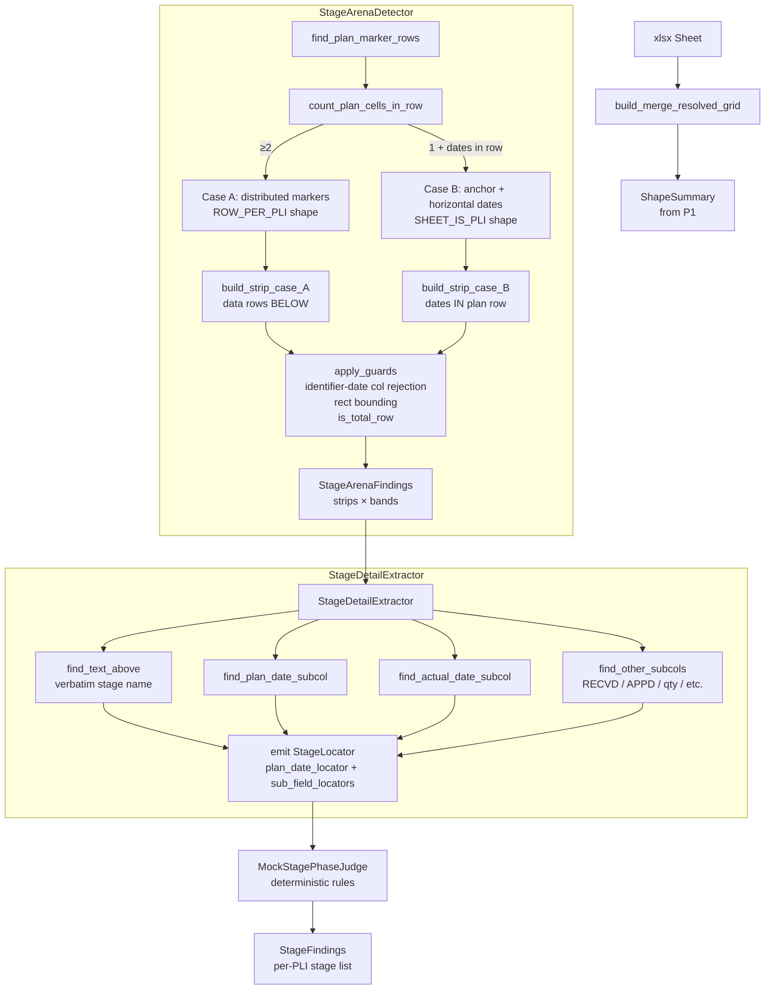
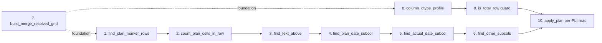
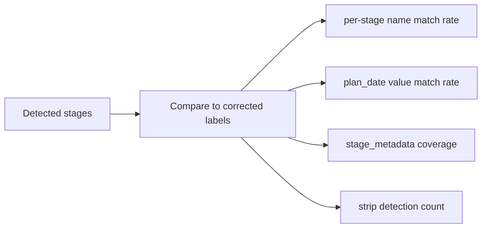
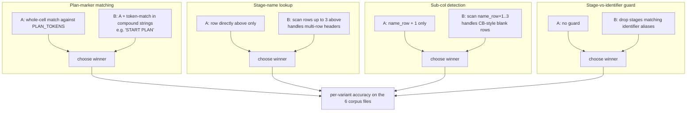

# P3 Visual Test Plan

Visual companion for the P3 stage-extraction probe. Four mock `.xlsx` files demonstrate
what each test inspects. Cells are colour-coded so you can see exactly what each test
"looks at" and what it emits.

**Open the `.xlsx` files in Excel / Numbers / LibreOffice. Each file has multiple
sheets — one per test scenario.**

## Colour key (same across all files)

| colour | meaning |
|---|---|
| 🟥 **dark red** | test's PRIMARY inspection target — the cell the test reads |
| 🟧 **light red** | cells affected / scanned by the test (context for the primary target) |
| 🟩 **light green** | cells the test EMITS as output (e.g. detected names, dates) |
| 🟨 **light yellow** | data cells (the actual PLI values — context) |
| ⬜ **light gray** | header / non-test cells (general context) |
| 🟪 **purple** | cells inside a merge range (top-left holds the actual value) |

---

## P3 architecture — at a glance



## Two structural cases the detector handles

```mermaid
flowchart LR
    subgraph "Case A — ROW_PER_PLI (distributed Plan markers)"
        A1[row 2: stage names<br/>Trims | Fabric | Sewing]
        A2[row 3: Planned | Planned | Planned ...<br/>multiple cells say Plan]
        A3[row 4+: dates below each Plan marker<br/>one PLI per row]
        A1 --> A2 --> A3
    end

    subgraph "Case B — SHEET_IS_PLI (single anchor + horizontal)"
        B1[row 8: stage names<br/>L/D send | Fit send | A/W send]
        B2[row 9: B9='Plan' anchor<br/>+ dates C9..J9 in SAME row]
        B1 --> B2
    end
```

---

## The 4 mock xlsx files

### `01_simple_row_per_pli.xlsx` — DKN-style baseline

Six sheets, one per test. The base layout is a clean ROW_PER_PLI table with 3 PLIs and 5 stage bands (each with Planned + Actual sub-cols).

| sheet | test | what's highlighted |
|---|---|---|
| `1_find_plan_markers` | `find_plan_marker_rows(grid)` | row 3 cells containing "Planned" (5 cells, dark red) |
| `2_count_plan_cells` | `count_plan_cells_in_row(grid, row=3)` | same 5 cells → returns 5 → Case A (≥2 ⇒ distributed markers, ROW_PER_PLI) |
| `3_find_text_above` | `find_text_above(grid, row=3, col=<plan_col>)` | row 3 plan markers (light red) + row 2 names ABOVE them (green = emit) |
| `4_find_plan_date_subcol` | per-band Plan sub-col lookup | band cols F-G → F (dark red) is Plan, G (light red) is Actual |
| `5_find_actual_date_subcol` | per-band Actual sub-col lookup | F (light red) Plan, G (dark red) Actual — goes into stage_metadata |
| `6_per_pli_plan_date_read` | apply_plan reads per-PLI dates | F4, F5, F6 (green = emit) — Trims Inhouse plan_date per PLI |

### `02_multi_band_subcols.xlsx` — CHRISTIAN BERG-style with 4 bands

| sheet | test | what's highlighted |
|---|---|---|
| `1_find_plan_markers` | multi-band markers | row 3 has "PLAN" at E/H/K/M (4 cells, dark red) — 4 bands detected |
| `2_band_subcols` | `find_other_subcols(band_cols=[E,F,G])` | within FABRIC band: E=PLAN (light red, first-class), F=RECVD + G=APPD (dark red, into stage_metadata) |
| `3_merge_resolution` | `build_merge_resolved_grid` | A4='1063' (dark red), A5='' visually (light red) but resolved to '1063' via merge |
| `4_emit_per_pli_per_band` | StageDetailExtractor emits one Stage per (PLI × band) | row 4 cells across FABRIC + SEWING bands (green = emitted as stage data) |

### `03_sheet_is_pli_stacked.xlsx` — 63261-style

Two stacked stage strips (rows 8-9 and 13-14), plus an identifier kv block at the top.

| sheet | test | what's highlighted |
|---|---|---|
| `1_case_B_anchors` | `find_plan_marker_rows` + `count_plan_cells_in_row=1` | B9 and B14 (dark red) — single Plan anchors per strip; Case B applies |
| `2_case_B_horizontal_dates` | `find_date_cells_in_row(row=9)` | B9 (anchor, light red) + C9..J9 (8 date cells, dark red); names C8..J8 (green = emit) |
| `3_stacked_strips` | StageArenaDetector emits 2 StageStrips | both strips' anchors + dates + names highlighted — 16 total stages |
| `4_stage_wins_over_identifier` | Principle 5 disambiguation | D4=Ex-Fty / E4=date (green = ex_fty_date identifier), D5=Delivery / E5=date (green = delivery_date identifier). No stage column with these names exists → no conflict. |

### `04_guards_and_open_vocab.xlsx` — false-positive guards + open-vocab demo

| sheet | test | what's highlighted |
|---|---|---|
| `1_dtype_profile_guard` | Plan-marker gate rejects identifier date cols | D/E "Trims Inhouse"/"Sewing" (green = real stages, row 3 has "Planned"). B/C "PO Date"/"Ex Factory" (light red = NOT stages — no row 3 Plan marker) |
| `2_grand_total_guard` | `is_total_row` guard | row 6 "Grand Total" cells (dark red = SKIPPED, not emitted as a PLI) |
| `3_open_vocab_unknown_name` | open-vocab demo | C/D/E stage names "BULK PACKING", "WEAVING START", "FUSING" (green = emitted verbatim). Their row 3 "Planned" markers (dark red). None are in STAGE_SPECS — all ship with `canonical=None`. |

---

## The 10 tests this probe runs



| # | test | file/sheet | what it answers |
|---|---|---|---|
| 1 | `find_plan_marker_rows` | 01 sheet 1, 02 sheet 1, 03 sheet 1 | Which rows contain "Plan"/"Planned"/"Scheduled"? |
| 2 | `count_plan_cells_in_row` | 01 sheet 2, 03 sheet 1 | Per plan row: how many Plan cells? (Case A vs B disambiguator) |
| 3 | `find_text_above` | 01 sheet 3, 02 sheet 1, 03 sheet 2 | For each Plan col, what's the verbatim stage name? |
| 4 | `find_plan_date_subcol` | 01 sheet 4 | Within a band, which sub-col is Plan? |
| 5 | `find_actual_date_subcol` | 01 sheet 5 | Which sub-col is Actual (into stage_metadata)? |
| 6 | `find_other_subcols` | 02 sheet 2 | What other sub-cols exist (RECVD/APPD/qty)? All into stage_metadata bag. |
| 7 | `build_merge_resolved_grid` | 02 sheet 3 | (foundation) — populates every cell in a merge range with the top-left value |
| 8 | `column_dtype_profile` | 04 sheet 1 | (guard) — used to filter false-positive stage cols |
| 9 | `is_total_row` | 04 sheet 2 | (guard) — skip Grand Total summary rows |
| 10 | apply_plan per-PLI read | 01 sheet 6 | For each PLI anchor, read plan_date from band's plan_col via FieldLocator |

---

## Open-vocab demonstration

```mermaid
flowchart TB
    subgraph "Known stage (in STAGE_SPECS)"
        K1[xlsx cell: 'Sewing Start'] --> K2[detected via row 3 'Planned' marker]
        K2 --> K3[Stage name='Sewing Start' verbatim]
        K3 --> K4[try_attach_canonical → matches 'sewing_start']
        K4 --> K5[Final: Stage(name='Sewing Start', canonical='sewing_start', plan_date=...)]
    end

    subgraph "Novel stage (NOT in STAGE_SPECS)"
        N1[xlsx cell: 'BULK PACKING'] --> N2[detected via row 3 'Planned' marker]
        N2 --> N3[Stage name='BULK PACKING' verbatim]
        N3 --> N4[try_attach_canonical → no match]
        N4 --> N5[Final: Stage(name='BULK PACKING', canonical=null, plan_date=...)]
    end
```

`04_guards_and_open_vocab.xlsx` sheet 3 demonstrates this — 3 stages with names the system has NEVER SEEN before flow through verbatim. The detector doesn't care; structural signal ("Planned" in row 3) is enough.

---

## What the probe will report

Per file from the actual dataset (DKN, CB, MOPD, 63261, GUESS):



For each file:
- **detected vs labelled stage count** (Δ = 0 ideally)
- **stage name verbatim agreement** rate (open-vocab match)
- **plan_date value agreement** per (PLI, stage) cell
- **stage_metadata coverage** — what fraction of label's actual_date / approval_date / qty captured
- **strip detection accuracy** — was the right number of strips found?
- **false positives** — any stage detected that shouldn't have been? (CB's "PO DATE" identifier leaking through, etc.)

---

## Variant comparisons in the probe



---

## Open questions for your review before P3 dispatches

1. **Mock judge scope** — I currently propose `MockStagePhaseJudge` does deterministic rules (chronology, identifier-name guard). Should it stay minimal (always-ACCEPT) for first pass?
2. **Scoring on un-labelled files** — CB / 63261 / Eastman labels aren't fixed yet. Should P3 report detection counts only (no scoring) for those, and score only against my 12 corrected files?
3. **Variant scope** — keep all 4 variant comparisons or trim to 2 most important (plan-marker matching + sub-col detection)?
4. **File set** — include all 6 representative files, or trim to 4 (drop GUESS + Eastman since their stage structures are simpler/different)?

Open the four `.xlsx` files in this folder to see the highlighted scenarios, then point me at any test you want clarified or any variant we should add/drop.
